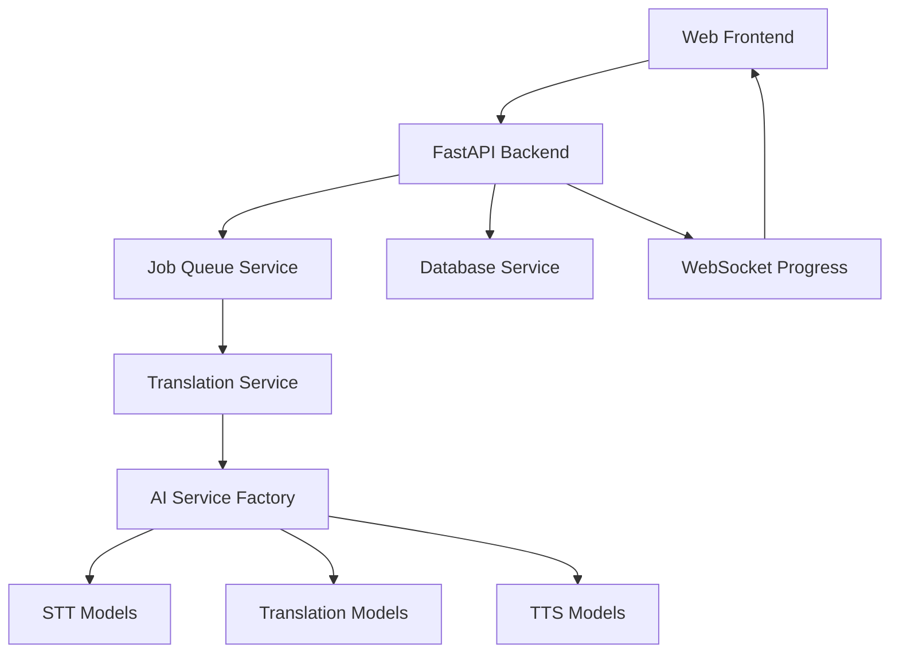

# AI Video Translation Service - Codebase Documentation

Welcome to the comprehensive documentation for the **AI Video Translation Service**, a sophisticated FastAPI-based application that translates videos from one language to another using state-of-the-art AI models.

## 📋 Table of Contents

| Document | Description |
|----------|-------------|
| **[Project Overview](overview.md)** | High-level project summary, technologies, and main functionality |
| **[Component Breakdown](components.md)** | Detailed analysis of all major components and services |
| **[Entry Point & Initialization](entry_point.md)** | Application startup process and main entry points |
| **[Execution Flow](execution_flow.md)** | Step-by-step walkthrough of video translation process |
| **[Architecture & Design Patterns](architecture.md)** | Architectural decisions, design patterns, and scalability |
| **[Flow Diagrams](flow_diagrams.md)** | Visual representations of system flows and processes |

## 🚀 Quick Start

This documentation is designed to help developers understand the codebase structure and implementation details. Start with the [Project Overview](overview.md) for a high-level understanding, then dive into specific components as needed.

## 🎯 What This Service Does

The AI Video Translation Service provides:

- **Video Translation**: Converts speech in videos from one language to another
- **Web Interface**: Modern drag-and-drop frontend for easy video uploads
- **Real-time Progress**: WebSocket-based progress tracking during translation
- **Job Management**: Persistent job storage with status tracking and download capabilities
- **AI Pipeline**: Integrated STT (Speech-to-Text), Translation, and TTS (Text-to-Speech) services

## 🏗️ Architecture Overview



## 📁 Project Structure

```
app/
├── main.py                 # FastAPI application entry point
├── api/routes/            # API endpoint definitions
├── models/                # Data models and schemas
├── services/              # Core business logic services
│   ├── processing/        # Audio/video processing pipeline
│   ├── stt/              # Speech-to-text services
│   ├── translation/      # Translation services
│   └── tts/              # Text-to-speech services
├── static/               # Frontend assets (CSS, JS)
└── templates/            # HTML templates
```

## 🔧 Key Technologies

- **Backend**: FastAPI, Python 3.8+
- **AI Models**: Whisper (STT), NLLB (Translation), MMS (TTS), PyAnnote (Diarization)
- **Database**: SQLite with async support
- **Frontend**: Vanilla JavaScript with modern CSS
- **Infrastructure**: Docker, Docker Compose
- **Processing**: FFmpeg for audio/video manipulation

## 📖 How to Use This Documentation

1. **New to the project?** Start with [Project Overview](overview.md)
2. **Need to understand a specific component?** Check [Component Breakdown](components.md)
3. **Want to trace the execution flow?** See [Execution Flow](execution_flow.md)
4. **Looking for architectural insights?** Read [Architecture & Design Patterns](architecture.md)
5. **Prefer visual representations?** Browse [Flow Diagrams](flow_diagrams.md)

## 🎯 Target Audience

This documentation is designed for:
- **Software Engineers** joining the project
- **DevOps Engineers** deploying and maintaining the service
- **Product Managers** understanding technical capabilities
- **QA Engineers** testing the system comprehensively

## 📝 Documentation Standards

Each document follows these principles:
- **Self-contained**: Can be read independently
- **Cross-referenced**: Links to related sections
- **Code examples**: Actual code snippets from the project
- **Visual aids**: Diagrams and flowcharts where helpful
- **Technical depth**: Detailed enough for implementation understanding

---

*Last updated: December 2024 | Version: 5.0.0*
