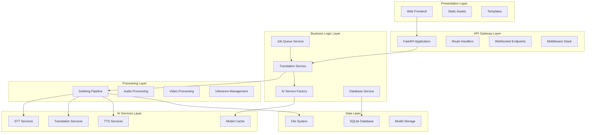
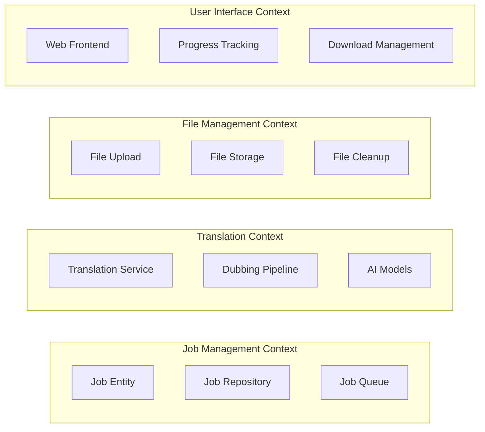

# Architecture and Design Patterns

This document explores the architectural decisions, design patterns, and principles that shape the AI Video Translation Service. Understanding these patterns is crucial for maintaining, extending, and scaling the system effectively.

## 🏛️ Overall Architecture

### Architectural Style: Layered Microservices

The system follows a **layered microservices architecture** with clear separation of concerns:



### Key Architectural Principles

1. **Separation of Concerns**: Each layer has distinct responsibilities
2. **Dependency Inversion**: Higher layers depend on abstractions, not implementations
3. **Single Responsibility**: Each service has one primary purpose
4. **Open/Closed Principle**: Open for extension, closed for modification
5. **Interface Segregation**: Clients depend only on interfaces they use

## 🎯 Design Patterns

### 1. Factory Pattern - AI Service Factory

**Purpose**: Centralized creation and management of AI model instances

**Implementation**:
```python
class AIServiceFactory:
    """Factory for creating and caching AI service instances."""
    
    def __new__(cls):
        """Singleton pattern implementation."""
        if not hasattr(cls, '_instance'):
            cls._instance = super().__new__(cls)
        return cls._instance
    
    def get_stt_service(self, stt_type: str, model_name: str) -> Any:
        """Factory method for STT services."""
        config = ModelConfig(ModelType.STT, stt_type, model_name)
        cached_model = self.load_model(config)
        
        if stt_type == "faster-whisper":
            return SpeechToTextFasterWhisper(cached_model.instance)
        elif stt_type == "transformers":
            return SpeechToTextWhisperTransformers(cached_model.instance)
        else:
            raise ValueError(f"Unknown STT type: {stt_type}")
```

**Benefits**:
- Encapsulates object creation logic
- Provides consistent interface for service creation
- Enables easy addition of new AI service types
- Centralizes model caching and memory management

### 2. Singleton Pattern - Service Instances

**Purpose**: Ensure single instances of critical services

**Implementation**:
```python
_ai_factory = None
_database_service = None
_job_queue_service = None

def get_ai_factory() -> AIServiceFactory:
    """Get singleton AI Service Factory instance."""
    global _ai_factory
    if _ai_factory is None:
        _ai_factory = AIServiceFactory()
    return _ai_factory

async def get_database_service() -> DatabaseService:
    """Get singleton database service instance."""
    global _database_service
    if _database_service is None:
        _database_service = DatabaseService()
        await _database_service.initialize()
    return _database_service
```

**Benefits**:
- Prevents multiple instances of expensive resources
- Ensures consistent state across the application
- Simplifies resource management and cleanup

### 3. Observer Pattern - Progress Updates

**Purpose**: Real-time progress notification system

**Implementation**:
```python
class JobQueueService:
    def __init__(self):
        self._progress_callbacks: Dict[str, List[Callable]] = {}
    
    def add_progress_callback(self, job_id: str, callback: Callable):
        """Register callback for job progress updates."""
        if job_id not in self._progress_callbacks:
            self._progress_callbacks[job_id] = []
        self._progress_callbacks[job_id].append(callback)
    
    async def _send_progress_update(self, job_id: str, update: ProgressUpdate):
        """Notify all observers of progress update."""
        if job_id in self._progress_callbacks:
            for callback in self._progress_callbacks[job_id]:
                try:
                    await callback(update)
                except Exception as e:
                    logger.error(f"Progress callback failed: {e}")
```

**Benefits**:
- Decouples progress producers from consumers
- Enables multiple subscribers to job progress
- Supports real-time UI updates via WebSocket

### 4. Strategy Pattern - AI Model Selection

**Purpose**: Interchangeable AI model implementations

**Implementation**:
```python
# Base strategy interface
class SpeechToText(ABC):
    @abstractmethod
    def transcribe_audio_chunks(self, utterance_metadata, source_language, no_dubbing_phrases):
        pass
    
    @abstractmethod
    def detect_language(self, audio_file):
        pass

# Concrete strategies
class SpeechToTextFasterWhisper(SpeechToText):
    def transcribe_audio_chunks(self, utterance_metadata, source_language, no_dubbing_phrases):
        # Faster Whisper implementation
        pass

class SpeechToTextWhisperTransformers(SpeechToText):
    def transcribe_audio_chunks(self, utterance_metadata, source_language, no_dubbing_phrases):
        # Transformers implementation
        pass
```

**Benefits**:
- Allows runtime selection of AI models
- Enables easy addition of new model implementations
- Supports A/B testing and performance optimization

### 5. Template Method Pattern - Dubbing Pipeline

**Purpose**: Define algorithm skeleton with customizable steps

**Implementation**:
```python
class Dubber:
    def dub(self) -> PostprocessingArtifacts:
        """Template method defining the dubbing algorithm."""
        self._verify_api_access()
        
        # Fixed algorithm steps
        self.run_preprocessing()
        self.run_speech_to_text()
        self.run_translation()
        self.run_configure_text_to_speech()
        self.run_text_to_speech()
        self.run_postprocessing()
        self.run_cleaning()
        
        return self.postprocessing_output
    
    # Customizable steps (can be overridden)
    def run_preprocessing(self):
        # Default implementation
        pass
    
    def run_speech_to_text(self):
        # Default implementation
        pass
```

**Benefits**:
- Defines consistent processing workflow
- Allows customization of individual steps
- Ensures proper order of operations

### 6. Repository Pattern - Database Access

**Purpose**: Abstract data access layer

**Implementation**:
```python
class DatabaseService:
    """Repository for job data access."""
    
    async def create_job(self, job_create: JobCreate) -> Job:
        """Create new job record."""
        # Implementation details abstracted
        pass
    
    async def get_job(self, job_id: str) -> Optional[Job]:
        """Retrieve job by ID."""
        # Implementation details abstracted
        pass
    
    async def list_jobs(self, status: Optional[str] = None, limit: int = 50, offset: int = 0):
        """List jobs with filtering and pagination."""
        # Implementation details abstracted
        pass
```

**Benefits**:
- Separates business logic from data access
- Enables easy database technology changes
- Simplifies testing with mock repositories

### 7. Command Pattern - Job Processing

**Purpose**: Encapsulate job processing requests

**Implementation**:
```python
@dataclass
class TranslationRequest:
    """Command object for translation operations."""
    input_file: str
    source_language: Optional[str]
    target_language: str
    tts: str = "mms"
    stt: str = "auto"
    translator: str = "nllb"
    # ... other parameters

class TranslationService:
    def translate_video(self, request: TranslationRequest) -> TranslationResult:
        """Execute translation command."""
        # Process the command
        pass
```

**Benefits**:
- Encapsulates request parameters
- Enables request queuing and logging
- Supports undo operations and request replay

## 🔧 Architectural Patterns

### 1. Layered Architecture

**Structure**:
```
┌─────────────────────────────────────┐
│         Presentation Layer          │  ← Web UI, Templates, Static Assets
├─────────────────────────────────────┤
│           API Layer                 │  ← FastAPI, Routes, WebSockets
├─────────────────────────────────────┤
│        Business Logic Layer        │  ← Services, Orchestration
├─────────────────────────────────────┤
│         Processing Layer            │  ← AI Pipeline, File Processing
├─────────────────────────────────────┤
│           Data Layer                │  ← Database, File System
└─────────────────────────────────────┘
```

**Benefits**:
- Clear separation of concerns
- Easy to understand and maintain
- Supports independent layer testing
- Enables technology substitution per layer

### 2. Event-Driven Architecture

**Implementation**: WebSocket-based progress updates

```python
# Event producer
async def _send_progress_update(self, job_id: str, update: ProgressUpdate):
    """Produce progress event."""
    event = {
        "type": "progress_update",
        "job_id": job_id,
        "stage": update.stage,
        "percentage": update.percentage,
        "message": update.message,
        "timestamp": update.timestamp.isoformat()
    }
    
    # Broadcast to all subscribers
    await self._broadcast_event(job_id, event)

# Event consumer (WebSocket client)
ws.onmessage = (event) => {
    const update = JSON.parse(event.data);
    if (update.type === 'progress_update') {
        updateProgressBar(update.percentage);
        updateStatusText(update.stage);
    }
};
```

**Benefits**:
- Loose coupling between components
- Real-time user experience
- Scalable notification system
- Supports multiple event consumers

### 3. Pipeline Architecture

**Implementation**: Seven-stage dubbing pipeline

```python
class DubbingPipeline:
    """Pipeline for video dubbing process."""
    
    def __init__(self):
        self.stages = [
            PreprocessingStage(),
            SpeechToTextStage(),
            TranslationStage(),
            VoiceConfigurationStage(),
            TextToSpeechStage(),
            PostprocessingStage(),
            CleanupStage()
        ]
    
    def execute(self, input_data):
        """Execute pipeline stages sequentially."""
        data = input_data
        for stage in self.stages:
            data = stage.process(data)
        return data
```

**Benefits**:
- Clear data flow through processing stages
- Easy to add, remove, or reorder stages
- Supports parallel processing of independent stages
- Enables stage-specific error handling and recovery

## 🎨 Domain-Driven Design Elements

### 1. Bounded Contexts

The system is organized into distinct bounded contexts:



### 2. Domain Entities

**Job Entity**:
```python
@dataclass
class Job:
    """Core domain entity representing a translation job."""
    id: str
    original_filename: str
    source_language: str
    target_language: str
    status: str
    input_file_path: Optional[str]
    output_file_path: Optional[str]
    # ... other attributes
    
    def is_completed(self) -> bool:
        """Domain logic for completion check."""
        return self.status == "completed"
    
    def can_be_cancelled(self) -> bool:
        """Domain logic for cancellation eligibility."""
        return self.status in ["uploaded", "processing"]
```

### 3. Value Objects

**Translation Request**:
```python
@dataclass(frozen=True)
class TranslationRequest:
    """Immutable value object for translation parameters."""
    input_file: str
    source_language: Optional[str]
    target_language: str
    tts: str
    stt: str
    translator: str
    translator_model: str
    stt_model: str
    output_directory: Optional[str]
    
    def __post_init__(self):
        """Validate value object invariants."""
        if not self.target_language:
            raise ValueError("Target language is required")
        if not os.path.exists(self.input_file):
            raise ValueError("Input file does not exist")
```

## 🔄 Concurrency Patterns

### 1. Producer-Consumer Pattern

**Implementation**: Job queue processing

```python
class JobQueueService:
    def __init__(self, max_concurrent_jobs: int = 2):
        self._job_queue = asyncio.Queue()
        self._active_jobs: Dict[str, asyncio.Task] = {}
        self._semaphore = asyncio.Semaphore(max_concurrent_jobs)
    
    async def submit_job(self, job: Job) -> str:
        """Producer: Add job to queue."""
        await self._job_queue.put(job)
        return job.id
    
    async def _process_queue(self):
        """Consumer: Process jobs from queue."""
        while True:
            job = await self._job_queue.get()
            async with self._semaphore:
                await self._process_job(job)
```

### 2. Async/Await Pattern

**Implementation**: Non-blocking I/O operations

```python
async def upload_video(file: UploadFile):
    """Async file upload with non-blocking I/O."""
    
    # Non-blocking file write
    async with aiofiles.open(file_path, 'wb') as f:
        content = await file.read()
        await f.write(content)
    
    # Non-blocking database operation
    db_service = await get_database_service()
    job = await db_service.create_job(job_create)
    
    # Non-blocking job submission
    job_queue = get_job_queue_service()
    await job_queue.submit_job(job)
    
    return job.id
```

### 3. Semaphore Pattern

**Implementation**: Concurrency control

```python
class JobQueueService:
    def __init__(self, max_concurrent_jobs: int = 2):
        self._semaphore = asyncio.Semaphore(max_concurrent_jobs)
    
    async def _process_job_with_cleanup(self, job: Job):
        """Process job with concurrency limits."""
        async with self._semaphore:
            try:
                await self._processor.process_job(job)
            finally:
                # Cleanup regardless of success/failure
                self._cleanup_job(job.id)
```

## 🚀 Scalability Patterns

### 1. Horizontal Scaling

**Design Considerations**:
```python
# Stateless service design
class TranslationService:
    def __init__(self):
        # No instance state - all state in database/cache
        self._ai_factory = get_ai_factory()  # Shared singleton
    
    def translate_video(self, request: TranslationRequest):
        # All data passed via parameters
        # No reliance on instance state
        pass
```

**Benefits**:
- Multiple service instances can run simultaneously
- Load balancing across instances
- No session affinity required
- Easy container orchestration

### 2. Caching Strategy

**Multi-Level Caching**:
```python
class AIServiceFactory:
    def __init__(self):
        # Level 1: In-memory model cache
        self._model_cache: Dict[str, CachedModel] = {}
        
        # Level 2: Disk-based model storage
        self._model_storage_path = "models/"
        
        # Level 3: Remote model repository (Hugging Face)
        self._remote_cache = True
    
    def load_model(self, config: ModelConfig):
        # Try cache levels in order
        if model := self._get_from_memory_cache(config):
            return model
        if model := self._get_from_disk_cache(config):
            return model
        return self._download_and_cache(config)
```

### 3. Resource Management

**Memory Management**:
```python
class ResourceManager:
    def __init__(self):
        self._memory_threshold = 0.85
        self._cleanup_interval = 300  # 5 minutes
    
    def monitor_resources(self):
        """Continuous resource monitoring."""
        while True:
            memory_usage = self._get_memory_usage()
            if memory_usage > self._memory_threshold:
                self._trigger_cleanup()
            time.sleep(self._cleanup_interval)
    
    def _trigger_cleanup(self):
        """Cleanup least recently used models."""
        ai_factory = get_ai_factory()
        ai_factory.evict_least_recently_used()
```

## 🔒 Security Patterns

### 1. Input Validation

**File Upload Security**:
```python
def validate_upload(file: UploadFile) -> None:
    """Comprehensive file validation."""
    
    # Size validation
    if file.size > MAX_FILE_SIZE:
        raise ValidationError("File too large")
    
    # Format validation
    if not file.filename.lower().endswith('.mp4'):
        raise ValidationError("Invalid file format")
    
    # Content validation
    if not _is_valid_video_file(file):
        raise ValidationError("Invalid video content")
    
    # Virus scanning (if enabled)
    if VIRUS_SCANNING_ENABLED:
        _scan_for_viruses(file)
```

### 2. Error Handling

**Secure Error Responses**:
```python
def handle_translation_error(error: Exception) -> TranslationResult:
    """Handle errors with secure error messages."""
    
    # Log detailed error internally
    logger.error(f"Translation failed: {error}", exc_info=True)
    
    # Return sanitized error to user
    if isinstance(error, ValidationError):
        user_message = str(error)
    elif isinstance(error, FileNotFoundError):
        user_message = "Input file not found"
    else:
        user_message = "Translation failed due to internal error"
    
    return TranslationResult(
        success=False,
        error_message=user_message
    )
```

## 📊 Performance Patterns

### 1. Lazy Loading

**Model Loading**:
```python
class AIServiceFactory:
    def get_stt_service(self, stt_type: str, model_name: str):
        """Lazy load models only when needed."""
        config = ModelConfig(ModelType.STT, stt_type, model_name)
        
        # Load model only when first requested
        if not self._is_model_loaded(config):
            self._load_model(config)
        
        return self._create_service(config)
```

### 2. Connection Pooling

**Database Connections**:
```python
class DatabaseService:
    def __init__(self):
        # Connection pool for concurrent access
        self._connection_pool = aiosqlite.Pool(
            database=self._database_url,
            min_size=2,
            max_size=10
        )
    
    async def execute_query(self, query: str, params: tuple):
        """Execute query using connection pool."""
        async with self._connection_pool.acquire() as conn:
            return await conn.execute(query, params)
```

### 3. Batch Processing

**Utterance Processing**:
```python
def process_utterances_batch(utterances: List[Utterance]) -> List[Utterance]:
    """Process multiple utterances in batch for efficiency."""
    
    # Group by language for batch translation
    language_groups = group_by_language(utterances)
    
    results = []
    for language, group in language_groups.items():
        # Batch translate all utterances for this language
        translated_texts = self.translation_service.translate_batch(
            texts=[u.text for u in group],
            target_language=language
        )
        
        # Update utterances with translations
        for utterance, translation in zip(group, translated_texts):
            utterance.translated_text = translation
            results.append(utterance)
    
    return results
```

## 🔧 Maintenance Patterns

### 1. Health Checks

**Comprehensive Health Monitoring**:
```python
@app.get("/health")
async def health_check():
    """Multi-component health check."""
    health_status = {
        "status": "healthy",
        "timestamp": datetime.utcnow().isoformat(),
        "components": {}
    }
    
    # Check each component
    components = [
        ("database", check_database_health),
        ("ai_factory", check_ai_factory_health),
        ("job_queue", check_job_queue_health),
        ("file_system", check_file_system_health)
    ]
    
    overall_healthy = True
    for name, check_func in components:
        try:
            component_health = await check_func()
            health_status["components"][name] = component_health
            if component_health["status"] != "healthy":
                overall_healthy = False
        except Exception as e:
            health_status["components"][name] = {
                "status": "unhealthy",
                "error": str(e)
            }
            overall_healthy = False
    
    if not overall_healthy:
        health_status["status"] = "unhealthy"
        return JSONResponse(status_code=503, content=health_status)
    
    return health_status
```

### 2. Graceful Degradation

**Service Degradation Strategy**:
```python
class TranslationService:
    def translate_video(self, request: TranslationRequest):
        """Translation with graceful degradation."""
        try:
            # Try primary translation service
            return self._translate_with_primary_service(request)
        except PrimaryServiceError:
            logger.warning("Primary service failed, trying fallback")
            try:
                # Fallback to secondary service
                return self._translate_with_fallback_service(request)
            except FallbackServiceError:
                # Final fallback - basic translation
                return self._translate_with_basic_service(request)
```

### 3. Circuit Breaker

**External Service Protection**:
```python
class CircuitBreaker:
    def __init__(self, failure_threshold: int = 5, timeout: int = 60):
        self.failure_threshold = failure_threshold
        self.timeout = timeout
        self.failure_count = 0
        self.last_failure_time = None
        self.state = "CLOSED"  # CLOSED, OPEN, HALF_OPEN
    
    def call(self, func, *args, **kwargs):
        """Execute function with circuit breaker protection."""
        if self.state == "OPEN":
            if time.time() - self.last_failure_time > self.timeout:
                self.state = "HALF_OPEN"
            else:
                raise CircuitBreakerOpenError("Service unavailable")
        
        try:
            result = func(*args, **kwargs)
            self._on_success()
            return result
        except Exception as e:
            self._on_failure()
            raise
    
    def _on_success(self):
        self.failure_count = 0
        self.state = "CLOSED"
    
    def _on_failure(self):
        self.failure_count += 1
        self.last_failure_time = time.time()
        if self.failure_count >= self.failure_threshold:
            self.state = "OPEN"
```

## 🎯 Key Architectural Benefits

### 1. Maintainability
- **Clear separation of concerns** makes code easy to understand and modify
- **Consistent patterns** reduce cognitive load for developers
- **Comprehensive documentation** supports knowledge transfer
- **Modular design** enables independent component updates

### 2. Scalability
- **Stateless services** support horizontal scaling
- **Async processing** handles high concurrency
- **Resource management** prevents memory exhaustion
- **Caching strategies** reduce computational overhead

### 3. Reliability
- **Error handling patterns** provide graceful failure recovery
- **Health monitoring** enables proactive issue detection
- **Circuit breakers** protect against cascading failures
- **Retry mechanisms** handle transient errors

### 4. Performance
- **Lazy loading** reduces startup time and memory usage
- **Connection pooling** optimizes database access
- **Batch processing** improves throughput
- **Pipeline architecture** enables parallel processing

### 5. Security
- **Input validation** prevents malicious uploads
- **Error sanitization** prevents information leakage
- **Resource limits** prevent denial of service
- **Secure defaults** minimize attack surface

---

*Next: [Flow Diagrams](flow_diagrams.md) - Visual representations of system flows and processes*
