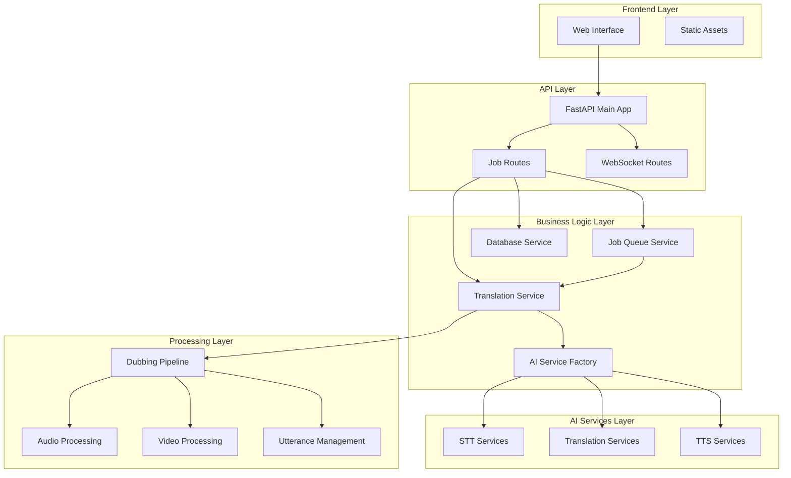
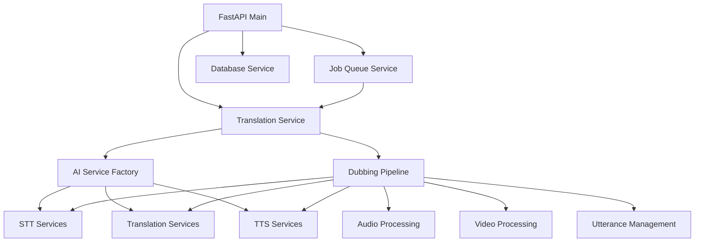

# Component Breakdown

This document provides a detailed analysis of all major components and services in the AI Video Translation Service, explaining their roles, responsibilities, dependencies, and key implementation details.

## 🏗️ Component Architecture Overview



## 🎯 Core Components

### 1. FastAPI Main Application (`app/main.py`)

**Role**: Central application entry point and service orchestrator

**Responsibilities**:
- Application lifecycle management (startup/shutdown)
- Service initialization and dependency injection
- Route registration and middleware configuration
- Health monitoring and status reporting
- Error handling and exception management

**Key Features**:
```python
# Service initialization on startup
@app.on_event("startup")
async def startup_event():
    # Initialize database service
    db_service = await get_database_service()
    
    # Initialize AI Service Factory with model preloading
    ai_factory = get_ai_factory()
    ai_factory.preload_default_models()
    
    # Initialize translation service
    translation_service = TranslationService()
    
    # Initialize job queue
    job_queue = get_job_queue_service()
    job_queue.initialize(translation_service)
```

**Dependencies**:
- Database Service (for job persistence)
- Job Queue Service (for async processing)
- Translation Service (for video processing)
- AI Service Factory (for model management)

**Important Files**:
- `app/main.py` - Main application definition
- `requirements.txt` - Dependency specifications
- `docker-compose.yml` - Service orchestration

---

### 2. Translation Service (`app/services/translation_service.py`)

**Role**: Core business logic orchestrator for video translation

**Responsibilities**:
- Video translation workflow coordination
- AI service integration and management
- Input validation and error handling
- Processing pipeline orchestration
- Result generation and quality assurance

**Key Methods**:
```python
def translate_video(self, request: TranslationRequest) -> TranslationResult:
    """Main translation orchestration method"""
    # 1. Validate inputs (file format, languages)
    self._check_is_video(request.input_file)
    self._check_ffmpeg()
    
    # 2. Initialize AI services via factory
    tts = self._get_selected_tts(request.tts, device)
    stt = self._ai_factory.get_stt_service(request.stt, request.stt_model)
    translation = self._get_selected_translator(request.translator, request.translator_model, device)
    
    # 3. Language validation
    self._check_languages(source_language, request.target_language, tts, translation, stt)
    
    # 4. Execute dubbing pipeline
    dubber = Dubber(...)
    result = dubber.dub()
    
    return TranslationResult(success=True, ...)
```

**Dependencies**:
- AI Service Factory (for model access)
- Dubbing Pipeline (for processing)
- FFmpeg (for media validation)
- Environment configuration

**Error Handling**:
- `InvalidLanguageError` - Language validation failures
- `InvalidFileFormatError` - Unsupported file formats
- `MissingDependencyError` - Missing system dependencies
- `ConfigurationError` - Service configuration issues

---

### 3. AI Service Factory (`app/services/ai_service_factory.py`)

**Role**: Centralized AI model management and caching system

**Responsibilities**:
- Model loading and initialization
- Memory-efficient model caching
- Service instance creation
- Resource management and cleanup
- Health monitoring for AI services

**Architecture Pattern**: Singleton with lazy loading

**Key Features**:
```python
class AIServiceFactory:
    def __init__(self):
        self._model_cache: Dict[str, CachedModel] = {}
        self._cache_lock = threading.Lock()
        self._memory_threshold = 0.85  # 85% memory usage threshold
    
    def load_model(self, config: ModelConfig) -> CachedModel:
        """Load model with caching and memory management"""
        cache_key = self._get_cache_key(config)
        
        with self._cache_lock:
            if cache_key in self._model_cache:
                cached_model = self._model_cache[cache_key]
                cached_model.last_accessed = time.time()
                return cached_model
            
            # Memory check before loading
            if self._get_memory_usage() > self._memory_threshold:
                self._evict_least_recently_used()
            
            # Load new model
            model = self._load_model_by_type(config)
            self._model_cache[cache_key] = model
            return model
```

**Model Types Supported**:
- **STT Models**: Whisper (faster-whisper, transformers)
- **Translation Models**: NLLB (various sizes)
- **TTS Models**: MMS (Massively Multilingual Speech)

**Memory Management**:
- LRU (Least Recently Used) eviction policy
- Memory usage monitoring
- Configurable cache size limits
- Automatic cleanup on shutdown

---

### 4. Job Queue Service (`app/services/job_queue_service.py`)

**Role**: Asynchronous job processing and queue management

**Responsibilities**:
- Job submission and queuing
- Concurrent job processing with limits
- Progress tracking and callbacks
- Job cancellation and cleanup
- Queue status monitoring

**Architecture Pattern**: Producer-Consumer with async processing

**Key Components**:
```python
class JobQueueService:
    def __init__(self, max_concurrent_jobs: Optional[int] = None):
        self._job_queue = asyncio.Queue()
        self._active_jobs: Dict[str, asyncio.Task] = {}
        self._progress_callbacks: Dict[str, List[Callable]] = {}
        self._max_concurrent_jobs = max_concurrent_jobs or 2
        self._semaphore = asyncio.Semaphore(self._max_concurrent_jobs)
    
    async def submit_job(self, job: Job) -> str:
        """Submit job for async processing"""
        await self._job_queue.put(job)
        logger.info(f"Job {job.id} submitted to queue")
        return job.id
    
    async def _process_queue(self):
        """Main queue processing loop"""
        while True:
            try:
                job = await self._job_queue.get()
                task = asyncio.create_task(self._process_job_with_cleanup(job))
                self._active_jobs[job.id] = task
            except Exception as e:
                logger.error(f"Queue processing error: {e}")
```

**Progress Tracking**:
- WebSocket callback system
- Real-time progress updates
- Stage-based progress reporting
- Error propagation and handling

**Dependencies**:
- Translation Service (for job processing)
- Database Service (for job persistence)
- WebSocket connections (for progress updates)

---

### 5. Database Service (`app/services/database_service.py`)

**Role**: Data persistence and job lifecycle management

**Responsibilities**:
- Job CRUD operations
- Database schema management
- Query optimization and pagination
- Transaction management
- Health monitoring

**Database Schema**:
```sql
CREATE TABLE jobs (
    id TEXT PRIMARY KEY,
    original_filename TEXT NOT NULL,
    source_language TEXT NOT NULL,
    target_language TEXT NOT NULL,
    status TEXT NOT NULL,
    input_file_path TEXT,
    output_file_path TEXT,
    input_file_size INTEGER,
    output_file_size INTEGER,
    processing_time_seconds REAL,
    error_message TEXT,
    stt_engine TEXT,
    stt_model TEXT,
    translation_engine TEXT,
    translation_model TEXT,
    tts_engine TEXT,
    job_metadata TEXT,  -- JSON blob
    created_at TIMESTAMP,
    updated_at TIMESTAMP,
    completed_at TIMESTAMP
);
```

**Key Operations**:
```python
async def create_job(self, job_create: JobCreate) -> Job:
    """Create new job with generated ID"""
    job_id = str(uuid.uuid4())
    # Insert job with all metadata
    
async def update_job(self, job_id: str, job_update: JobUpdate) -> Optional[Job]:
    """Update job status and metadata"""
    # Atomic update with timestamp management
    
async def list_jobs(self, status: Optional[str] = None, limit: int = 50, offset: int = 0):
    """Paginated job listing with filtering"""
    # Optimized queries with proper indexing
```

**Performance Features**:
- Connection pooling with aiosqlite
- Prepared statements for security
- Efficient pagination
- Index optimization for common queries

---

### 6. Dubbing Pipeline (`app/services/processing/dubbing.py`)

**Role**: Core video translation processing pipeline

**Responsibilities**:
- End-to-end dubbing workflow orchestration
- Stage-by-stage processing coordination
- Resource management and cleanup
- Progress reporting and error handling
- Quality assurance and validation

**Processing Stages**:
```python
def dub(self) -> PostprocessingArtifacts:
    """7-stage dubbing pipeline"""
    
    # Stage 1: Preprocessing
    self.run_preprocessing()  # Video/audio split, speaker diarization
    
    # Stage 2: Speech-to-Text
    self.run_speech_to_text()  # Transcription, gender classification
    
    # Stage 3: Translation
    self.run_translation()  # Text translation
    
    # Stage 4: Voice Configuration
    self.run_configure_text_to_speech()  # Voice assignment
    
    # Stage 5: Text-to-Speech
    self.run_text_to_speech()  # Audio generation
    
    # Stage 6: Audio Processing
    self.run_postprocessing()  # Audio/video recombination
    
    # Stage 7: Cleanup
    self.run_cleaning()  # Temporary file cleanup
```

**Key Features**:
- Memory usage monitoring
- Processing time tracking
- Intermediate file management
- Error recovery and rollback
- Quality validation at each stage

**Dependencies**:
- PyAnnote (speaker diarization)
- STT Services (speech recognition)
- Translation Services (text translation)
- TTS Services (speech synthesis)
- FFmpeg (audio/video processing)

---

## 🎨 Frontend Components

### 7. Web Interface (`templates/index.html`)

**Role**: User-facing web application interface

**Responsibilities**:
- File upload with drag-and-drop support
- Real-time progress visualization
- Job status monitoring and management
- Result preview and download
- Error handling and user feedback

**Key Features**:
```javascript
// File upload with validation
const handleFileUpload = (file) => {
    if (file.size > MAX_FILE_SIZE) {
        showError('File size exceeds 200MB limit');
        return;
    }
    if (!file.name.toLowerCase().endsWith('.mp4')) {
        showError('Only MP4 files are supported');
        return;
    }
    // Process upload...
};

// WebSocket progress tracking
const connectWebSocket = (jobId) => {
    const ws = new WebSocket(`ws://localhost:8000/api/v1/jobs/${jobId}/progress`);
    ws.onmessage = (event) => {
        const update = JSON.parse(event.data);
        updateProgressBar(update.percentage);
        updateStatusText(update.stage);
    };
};
```

**UI Components**:
- Upload area with drag-and-drop
- Progress bars and status indicators
- Job management interface
- Settings and configuration panels
- Download and preview controls

---

## 🔧 Processing Components

### 8. Audio Processing (`app/services/processing/audio_processing.py`)

**Role**: Audio manipulation and enhancement

**Responsibilities**:
- Speaker diarization with PyAnnote
- Audio segmentation and timing
- Dubbed audio track creation
- Volume normalization
- Quality optimization

### 9. Video Processing (`app/services/processing/video_processing.py`)

**Role**: Video file manipulation

**Responsibilities**:
- Video/audio stream separation
- Audio/video recombination
- Format conversion and optimization
- Quality preservation
- Metadata handling

### 10. Utterance Management (`app/services/processing/utterance.py`)

**Role**: Speech segment organization and metadata

**Responsibilities**:
- Utterance metadata structure
- Speaker information tracking
- Timing synchronization
- Translation mapping
- Voice assignment coordination

---

## 🤖 AI Service Components

### 11. STT Services (`app/services/stt/`)

**Available Implementations**:
- `speech_to_text_faster_whisper.py` - Optimized Whisper implementation
- `speech_to_text_whisper_transformers.py` - Transformers-based Whisper
- `speech_to_text.py` - Base STT interface

**Capabilities**:
- Multi-language speech recognition
- Automatic language detection
- Speaker gender classification
- Batch processing support

### 12. Translation Services (`app/services/translation/`)

**Available Implementations**:
- `translation_nllb.py` - NLLB model implementation
- `translation.py` - Base translation interface

**Features**:
- 200+ language pair support
- Context-aware translation
- Batch processing optimization
- Quality scoring and validation

### 13. TTS Services (`app/services/tts/`)

**Available Implementations**:
- `text_to_speech_mms.py` - MMS model implementation
- `text_to_speech.py` - Base TTS interface

**Capabilities**:
- Multi-language speech synthesis
- Voice selection and assignment
- Timing preservation
- Quality optimization

---

## 🔗 Component Interactions

### Data Flow Between Components

1. **Upload Flow**: Frontend → API Routes → Database Service
2. **Processing Flow**: Job Queue → Translation Service → Dubbing Pipeline → AI Services
3. **Progress Flow**: Processing Components → Job Queue → WebSocket → Frontend
4. **Download Flow**: Frontend → API Routes → File System

### Dependency Graph



### Error Propagation

- **Component-level errors** are caught and wrapped with context
- **Service-level errors** are logged and reported to job status
- **User-facing errors** are sanitized and presented with helpful messages
- **System-level errors** trigger health check failures and alerts

---

*Next: [Entry Point & Initialization](entry_point.md) - Application startup and initialization process*
