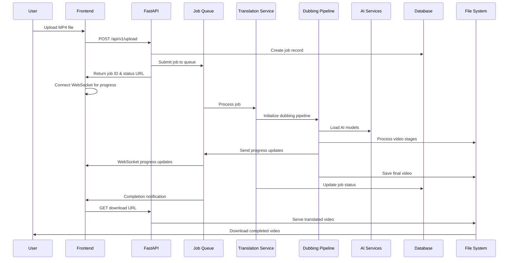
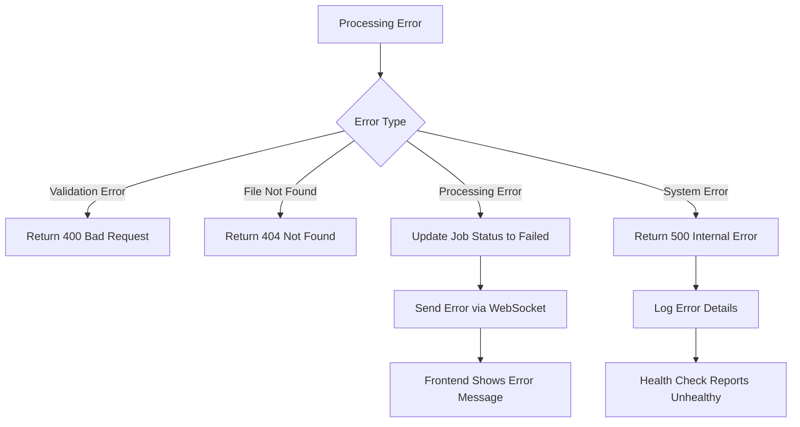

# Execution Flow

This document provides a comprehensive walkthrough of how a video translation request flows through the AI Video Translation Service, from initial upload to final download. Understanding this flow is essential for debugging, optimization, and system maintenance.

## 🎬 Complete Video Translation Journey

### Overview of the Translation Pipeline



## 📤 Stage 1: File Upload and Job Creation

### 1.1 Frontend File Upload

The process begins when a user uploads a video file through the web interface:

```javascript
// Frontend file upload handling
const handleFileUpload = async (file) => {
    // Validate file
    if (file.size > MAX_FILE_SIZE) {
        throw new Error('File size exceeds 200MB limit');
    }
    
    if (!file.name.toLowerCase().endsWith('.mp4')) {
        throw new Error('Only MP4 files are supported');
    }
    
    // Prepare form data
    const formData = new FormData();
    formData.append('file', file);
    formData.append('target_language', targetLanguage);
    formData.append('source_language', sourceLanguage);
    formData.append('stt_engine', sttEngine);
    formData.append('stt_model', sttModel);
    formData.append('translation_engine', translationEngine);
    formData.append('translation_model', translationModel);
    formData.append('tts_engine', ttsEngine);
    
    // Submit upload
    const response = await fetch('/api/v1/upload', {
        method: 'POST',
        body: formData
    });
    
    const result = await response.json();
    return result.job_id;
};
```

### 1.2 API Upload Endpoint Processing

The upload request is handled by the job routes:

```python
@router.post("/upload", response_model=UploadResponse)
async def upload_video(
    request: Request,
    file: UploadFile = File(...),
    target_language: str = Form(...),
    source_language: str = Form(...),
    # ... other parameters
):
    # Step 1: Validate file size and format
    if hasattr(file, 'size') and file.size and file.size > MAX_FILE_SIZE:
        raise HTTPException(status_code=413, detail="File size exceeds limit")
    
    if not file.filename or not file.filename.lower().endswith('.mp4'):
        raise HTTPException(status_code=400, detail="Only MP4 files supported")
    
    # Step 2: Save uploaded file
    uploads_dir = "uploads"
    os.makedirs(uploads_dir, exist_ok=True)
    
    timestamp = datetime.utcnow().strftime("%Y%m%d_%H%M%S")
    safe_filename = f"{timestamp}_{file.filename}"
    file_path = os.path.join(uploads_dir, safe_filename)
    
    async with aiofiles.open(file_path, 'wb') as f:
        content = await file.read()
        await f.write(content)
    
    # Step 3: Create job metadata
    job_metadata = JobMetadata(
        file_format="mp4",
        stt_engine=stt_engine,
        stt_model=stt_model,
        translation_engine=translation_engine,
        translation_model=translation_model,
        tts_engine=tts_engine,
        progress_stage="uploaded",
        progress_percentage=0.0
    )
    
    # Step 4: Create job record
    job_create = JobCreate(
        original_filename=file.filename,
        source_language=source_language,
        target_language=target_language,
        input_file_path=file_path,
        input_file_size=len(content),
        # ... other fields
        job_metadata=job_metadata
    )
    
    # Step 5: Store in database
    db_service = await get_database_service()
    job = await db_service.create_job(job_create)
    
    # Step 6: Submit to job queue
    job_queue = get_job_queue_service()
    await job_queue.submit_job(job)
    
    # Step 7: Return response with job ID and URLs
    return UploadResponse(
        job_id=job.id,
        status="uploaded",
        status_url=f"{base_url}/api/v1/jobs/{job.id}/status",
        websocket_url=f"ws://{host}/api/v1/jobs/{job.id}/progress",
        # ... other fields
    )
```

### 1.3 Database Job Record Creation

The job is persisted in the database with all metadata:

```python
async def create_job(self, job_create: JobCreate) -> Job:
    """Create new job with generated UUID."""
    job_id = str(uuid.uuid4())
    
    query = """
    INSERT INTO jobs (
        id, original_filename, source_language, target_language,
        status, input_file_path, input_file_size,
        stt_engine, stt_model, translation_engine, translation_model, tts_engine,
        job_metadata, created_at, updated_at
    ) VALUES (?, ?, ?, ?, ?, ?, ?, ?, ?, ?, ?, ?, ?, ?, ?)
    """
    
    await self._connection.execute(query, (
        job_id,
        job_create.original_filename,
        job_create.source_language,
        job_create.target_language,
        "uploaded",
        job_create.input_file_path,
        job_create.input_file_size,
        job_create.stt_engine,
        job_create.stt_model,
        job_create.translation_engine,
        job_create.translation_model,
        job_create.tts_engine,
        json.dumps(job_create.job_metadata.dict()),
        datetime.utcnow(),
        datetime.utcnow()
    ))
    
    await self._connection.commit()
    return await self.get_job(job_id)
```

## 🔄 Stage 2: Job Queue Processing

### 2.1 Job Queue Submission

The job is added to the async processing queue:

```python
async def submit_job(self, job: Job) -> str:
    """Submit job for async processing."""
    await self._job_queue.put(job)
    logger.info(f"Job {job.id} submitted to queue (queue size: {self._job_queue.qsize()})")
    return job.id
```

### 2.2 Queue Processing Loop

The job queue continuously processes jobs with concurrency limits:

```python
async def _process_queue(self):
    """Main queue processing loop with concurrency control."""
    while True:
        try:
            # Wait for next job
            job = await self._job_queue.get()
            
            # Check concurrency limits
            if len(self._active_jobs) >= self._max_concurrent_jobs:
                # Re-queue job if at capacity
                await self._job_queue.put(job)
                await asyncio.sleep(1)
                continue
            
            # Start job processing
            task = asyncio.create_task(self._process_job_with_cleanup(job))
            self._active_jobs[job.id] = task
            
            logger.info(f"Started processing job {job.id} "
                       f"(active: {len(self._active_jobs)}/{self._max_concurrent_jobs})")
            
        except Exception as e:
            logger.error(f"Queue processing error: {e}")
            await asyncio.sleep(5)  # Brief pause before retrying
```

### 2.3 Job Processing with Progress Tracking

Each job is processed with comprehensive progress tracking:

```python
async def _process_job_with_cleanup(self, job: Job):
    """Process job with proper cleanup and error handling."""
    try:
        # Update job status to processing
        await self._update_job_status(job.id, "processing", 
                                    {"progress_stage": "initializing", "progress_percentage": 0})
        
        # Process the job
        await self._processor.process_job(job, self._send_progress_update)
        
        # Update to completed status
        await self._update_job_status(job.id, "completed", 
                                    {"progress_stage": "completed", "progress_percentage": 100})
        
    except Exception as e:
        logger.error(f"Job {job.id} failed: {e}")
        await self._update_job_status(job.id, "failed", 
                                    {"error_message": str(e)})
    finally:
        # Clean up active job tracking
        if job.id in self._active_jobs:
            del self._active_jobs[job.id]
        
        # Remove progress callbacks
        self.remove_progress_callbacks(job.id)
```

## 🎯 Stage 3: Translation Service Processing

### 3.1 Translation Request Creation

The job processor creates a translation request:

```python
async def process_job(self, job: Job, progress_callback: Callable):
    """Process translation job with progress updates."""
    
    # Create translation request
    request = TranslationRequest(
        input_file=job.input_file_path,
        source_language=job.source_language,
        target_language=job.target_language,
        tts=job.tts_engine,
        stt=job.stt_engine,
        translator=job.translation_engine,
        translator_model=job.translation_model,
        stt_model=job.stt_model,
        output_directory=get_env_var("OUTPUT_DIRECTORY", "output/")
    )
    
    # Send initial progress
    await progress_callback(job.id, ProgressUpdate(
        stage="preprocessing",
        percentage=5,
        message="Starting video translation..."
    ))
    
    # Execute translation
    result = self._translation_service.translate_video(request)
    
    if result.success:
        # Update job with results
        await self._update_job_with_result(job, result)
    else:
        raise Exception(result.error_message)
```

### 3.2 Translation Service Orchestration

The translation service coordinates the entire process:

```python
def translate_video(self, request: TranslationRequest) -> TranslationResult:
    """Main translation orchestration with comprehensive error handling."""
    import time
    start_time = time.time()
    
    try:
        # Step 1: Validate inputs
        self._check_is_video(request.input_file)
        self._check_ffmpeg()
        
        # Step 2: Get configuration
        output_directory = request.output_directory or get_env_var("OUTPUT_DIRECTORY", "output/")
        device = get_env_var("DEVICE", "cpu")
        hugging_face_token = self._get_hugging_face_token()
        
        # Step 3: Initialize AI services (with caching)
        logger().info("Initializing AI services with caching...")
        
        tts = self._get_selected_tts(request.tts, device)
        stt = self._ai_factory.get_stt_service(request.stt, request.stt_model)
        
        # Auto-detect source language if needed
        source_language = request.source_language
        if not source_language:
            source_language = stt.detect_language(request.input_file)
            logger().info(f"Auto-detected source language: '{source_language}'")
        
        translation = self._get_selected_translator(request.translator, request.translator_model, device)
        
        # Step 4: Validate language support
        self._check_languages(source_language, request.target_language, tts, translation, stt)
        
        # Step 5: Create output directory
        if not os.path.exists(output_directory):
            os.makedirs(output_directory)
        
        # Step 6: Initialize and execute dubbing pipeline
        dubber = Dubber(
            input_file=request.input_file,
            output_directory=output_directory,
            source_language=source_language,
            target_language=request.target_language,
            hugging_face_token=hugging_face_token,
            tts=tts,
            translation=translation,
            stt=stt,
            device=device,
            # ... other parameters
        )
        
        logger().info(f"Processing '{request.input_file}' with device '{device}'")
        result = dubber.dub()
        
        processing_time = time.time() - start_time
        logger().info(f"Translation completed successfully in {processing_time:.2f}s")
        
        return TranslationResult(
            success=True,
            audio_file=result.audio_file,
            video_file=result.video_file,
            processing_time_seconds=processing_time
        )
        
    except Exception as e:
        processing_time = time.time() - start_time
        error_message = str(e)
        logger().error(f"Translation failed: {error_message}")
        
        return TranslationResult(
            success=False,
            error_message=error_message,
            processing_time_seconds=processing_time
        )
```

## 🎭 Stage 4: Dubbing Pipeline Execution

### 4.1 Seven-Stage Processing Pipeline

The dubbing pipeline executes seven distinct stages:

```python
def dub(self) -> PostprocessingArtifacts:
    """Execute the complete 7-stage dubbing pipeline."""
    self._verify_api_access()
    logger().info("Dubbing process starting...")
    
    times = {}
    start_time = time.time()
    
    # Stage 1: Preprocessing (Video/Audio Split + Speaker Diarization)
    task_start_time = time.time()
    self.run_preprocessing()
    times["preprocessing"] = self.log_debug_task_and_getime("Preprocessing completed", task_start_time)
    
    # Stage 2: Speech-to-Text (Transcription + Gender Classification)
    task_start_time = time.time()
    self.run_speech_to_text()
    times["stt"] = self.log_debug_task_and_getime("Speech to text completed", task_start_time)
    
    # Stage 3: Translation (Text Translation)
    task_start_time = time.time()
    self.run_translation()
    times["translation"] = self.log_debug_task_and_getime("Translation completed", task_start_time)
    
    # Stage 4: Voice Configuration (Voice Assignment)
    # Stage 5: Text-to-Speech (Audio Generation)
    task_start_time = time.time()
    self.run_configure_text_to_speech()
    self.run_text_to_speech()
    times["tts"] = self.log_debug_task_and_getime("Text to speech completed", task_start_time)
    
    # Stage 6: Postprocessing (Audio/Video Recombination)
    task_start_time = time.time()
    self.run_postprocessing()
    self._save_utterances()
    
    # Stage 7: Cleanup (Optional Intermediate File Removal)
    self.run_cleaning()
    times["postprocessing"] = self.log_debug_task_and_getime("Post processing completed", task_start_time)
    
    # Log performance metrics
    total_time = time.time() - start_time
    logger().info(f"Total execution time: {total_time:.2f} secs")
    for task in times:
        _time = times[task]
        per = _time * 100 / total_time
        logger().info(f" Task '{task}' in {_time:.2f} secs ({per:.2f}%)")
    
    return self.postprocessing_output
```

### 4.2 Detailed Stage Breakdown

#### Stage 1: Preprocessing
```python
def run_preprocessing(self) -> None:
    """Split audio/video and segment audio into utterances with PyAnnote."""
    # Split video into separate audio and video streams
    video_file, audio_file = VideoProcessing.split_audio_video(
        video_file=self.input_file, 
        output_directory=self.output_directory
    )
    
    # Perform speaker diarization using PyAnnote
    utterance_metadata = audio_processing.create_pyannote_timestamps(
        audio_file=audio_file,
        pipeline=self.pyannote_pipeline,
        device=self.device,
    )
    
    # Cut and save individual audio segments
    utterance_metadata = audio_processing.run_cut_and_save_audio(
        utterance_metadata=utterance_metadata,
        audio_file=audio_file,
        output_directory=self.output_directory,
    )
    
    self.utterance_metadata = utterance_metadata
    self.preprocessing_output = PreprocessingArtifacts(
        video_file=video_file,
        audio_file=audio_file,
    )
```

#### Stage 2: Speech-to-Text
```python
def run_speech_to_text(self) -> None:
    """Transcribe audio and apply speaker diarization."""
    # Transcribe each audio segment
    utterance_metadata = self.stt.transcribe_audio_chunks(
        utterance_metadata=self.utterance_metadata,
        source_language=self.source_language,
        no_dubbing_phrases=[],
    )
    
    # Predict speaker gender for voice matching
    media_file = (
        self.preprocessing_output.video_file
        if self.preprocessing_output.video_file
        else self.preprocessing_output.audio_file
    )
    speaker_info = self.stt.predict_gender(
        file=media_file,
        utterance_metadata=utterance_metadata,
    )
    
    # Add speaker information to metadata
    self.utterance_metadata = self.stt.add_speaker_info(
        utterance_metadata=utterance_metadata, 
        speaker_info=speaker_info
    )
    
    # Remove empty utterances
    utterance = Utterance(self.target_language, self.output_directory)
    self.utterance_metadata = utterance.get_without_empty_blocks(
        self.utterance_metadata
    )
```

#### Stage 3: Translation
```python
def run_translation(self) -> None:
    """Translate transcribed text."""
    self.utterance_metadata = self.translation.translate_utterances(
        utterance_metadata=self.utterance_metadata,
        source_language=self.source_language,
        target_language=self.target_language,
    )
```

#### Stage 4: Voice Configuration
```python
def run_configure_text_to_speech(self) -> None:
    """Configure Text-To-Speech process with voice assignments."""
    # Assign voices based on speaker characteristics
    assigned_voices = self.tts.assign_voices(
        utterance_metadata=self.utterance_metadata,
        target_language=self.target_language,
    )
    
    # Update metadata with voice assignments
    self.utterance_metadata = self.tts.update_utterance_metadata(
        utterance_metadata=self.utterance_metadata,
        assigned_voices=assigned_voices,
    )
```

#### Stage 5: Text-to-Speech
```python
def run_text_to_speech(self) -> None:
    """Convert translated text to speech."""
    self.utterance_metadata = self.tts.dub_utterances(
        utterance_metadata=self.utterance_metadata,
        output_directory=self.output_directory,
        target_language=self.target_language,
        audio_file=self.preprocessing_output.audio_file,
    )
```

#### Stage 6: Postprocessing
```python
def run_postprocessing(self) -> None:
    """Create dubbed audio track and combine with video."""
    # Create final dubbed audio track
    dubbed_audio_file = audio_processing.create_dubbed_audio_track(
        utterance_metadata=self.utterance_metadata,
        original_audio_file=self.preprocessing_output.audio_file,
        output_directory=self.output_directory,
        target_language=self.target_language,
    )
    
    # Combine dubbed audio with original video
    dubbed_video_file = VideoProcessing.combine_audio_video(
        video_file=self.preprocessing_output.video_file,
        dubbed_audio_file=dubbed_audio_file,
        output_directory=self.output_directory,
        target_language=self.target_language,
    )
    
    self.postprocessing_output = PostprocessingArtifacts(
        audio_file=dubbed_audio_file,
        video_file=dubbed_video_file,
    )
```

#### Stage 7: Cleanup
```python
def run_cleaning(self) -> None:
    """Clean up intermediate files if configured."""
    if not self.clean_intermediate_files:
        return
    
    # Get paths of intermediate files
    utterance = Utterance(self.target_language, self.output_directory)
    paths, dubbed_paths = utterance.get_files_paths(self.utterance_metadata)
    
    # Remove intermediate audio segments
    for path in paths + dubbed_paths:
        if os.path.exists(path):
            os.remove(path)
    
    # Remove temporary audio files
    temp_files = [f"dubbed_audio_{self.target_language}.mp3"]
    for filename in temp_files:
        full_path = os.path.join(self.output_directory, filename)
        if os.path.exists(full_path):
            os.remove(full_path)
```

## 📡 Stage 5: Real-time Progress Updates

### 5.1 WebSocket Connection Establishment

The frontend establishes a WebSocket connection for real-time progress:

```javascript
// Frontend WebSocket connection
const connectWebSocket = (jobId) => {
    const wsUrl = `ws://${window.location.host}/api/v1/jobs/${jobId}/progress`;
    const ws = new WebSocket(wsUrl);
    
    ws.onopen = () => {
        console.log('WebSocket connected for job:', jobId);
        // Send ping to verify connection
        ws.send(JSON.stringify({ type: 'ping' }));
    };
    
    ws.onmessage = (event) => {
        const update = JSON.parse(event.data);
        handleProgressUpdate(update);
    };
    
    ws.onclose = () => {
        console.log('WebSocket disconnected');
        // Attempt reconnection after delay
        setTimeout(() => connectWebSocket(jobId), 5000);
    };
    
    ws.onerror = (error) => {
        console.error('WebSocket error:', error);
    };
    
    return ws;
};

const handleProgressUpdate = (update) => {
    switch (update.type) {
        case 'progress_update':
            updateProgressBar(update.percentage);
            updateStatusText(update.stage);
            updateProgressMessage(update.message);
            break;
        case 'status_response':
            updateJobStatus(update.status);
            break;
        case 'error':
            showError(update.message);
            break;
        case 'pong':
            // Connection verified
            break;
    }
};
```

### 5.2 Progress Update Broadcasting

The job queue service broadcasts progress updates to connected WebSocket clients:

```python
async def _send_progress_update(self, job_id: str, update: ProgressUpdate):
    """Send progress update via WebSocket to connected clients."""
    if job_id in self._progress_callbacks:
        callbacks = self._progress_callbacks[job_id]
        
        # Broadcast to all connected clients for this job
        for callback in callbacks.copy():  # Copy to avoid modification during iteration
            try:
                await callback(update)
            except Exception as e:
                logger.error(f"Failed to send progress update for job {job_id}: {e}")
                # Remove failed callback
                if callback in callbacks:
                    callbacks.remove(callback)
```

### 5.3 Progress Update Types

Different types of progress updates are sent throughout the process:

```python
# Progress update data structure
@dataclass
class ProgressUpdate:
    stage: str              # Current processing stage
    percentage: float       # Completion percentage (0-100)
    message: str           # Human-readable status message
    timestamp: datetime    # Update timestamp
    job_id: str           # Associated job ID
    
# Example progress updates during processing
progress_updates = [
    ProgressUpdate("uploaded", 0, "File uploaded successfully", datetime.utcnow(), job_id),
    ProgressUpdate("preprocessing", 10, "Splitting audio and video...", datetime.utcnow(), job_id),
    ProgressUpdate("speaker_diarization", 20, "Identifying speakers...", datetime.utcnow(), job_id),
    ProgressUpdate("speech_to_text", 35, "Transcribing speech...", datetime.utcnow(), job_id),
    ProgressUpdate("translation", 50, "Translating text...", datetime.utcnow(), job_id),
    ProgressUpdate("voice_assignment", 65, "Assigning voices...", datetime.utcnow(), job_id),
    ProgressUpdate("text_to_speech", 80, "Generating speech...", datetime.utcnow(), job_id),
    ProgressUpdate("postprocessing", 95, "Combining audio and video...", datetime.utcnow(), job_id),
    ProgressUpdate("completed", 100, "Translation completed!", datetime.utcnow(), job_id),
]
```

## 📥 Stage 6: Job Completion and Result Handling

### 6.1 Job Status Update

When processing completes, the job status is updated in the database:

```python
async def _update_job_with_result(self, job: Job, result: TranslationResult):
    """Update job with translation results."""
    
    # Calculate output file size
    output_file_size = None
    if result.video_file and os.path.exists(result.video_file):
        output_file_size = os.path.getsize(result.video_file)
    
    # Update job record
    job_update = JobUpdate(
        status="completed",
        output_file_path=result.video_file,
        output_file_size=output_file_size,
        processing_time_seconds=result.processing_time_seconds,
        completed_at=datetime.utcnow(),
        job_metadata={
            "progress_stage": "completed",
            "progress_percentage": 100.0,
            "audio_file": result.audio_file,
            "video_file": result.video_file
        }
    )
    
    db_service = await get_database_service()
    await db_service.update_job(job.id, job_update)
```

### 6.2 Frontend Completion Handling

The frontend handles job completion and enables download:

```javascript
const handleJobCompletion = (jobData) => {
    // Update UI to show completion
    updateProgressBar(100);
    updateStatusText('Completed');
    
    // Show success actions
    document.getElementById('successActions').style.display = 'block';
    document.getElementById('cancelJobBtn').style.display = 'none';
    
    // Enable download button
    const downloadBtn = document.getElementById('downloadBtn');
    downloadBtn.onclick = () => {
        window.location.href = `/api/v1/jobs/${jobData.job_id}/download`;
    };
    
    // Enable preview button
    const previewBtn = document.getElementById('previewBtn');
    previewBtn.onclick = () => {
        showPreview(jobData.job_id);
    };
    
    // Show completion notification
    showNotification('Translation completed successfully!', 'success');
};
```

## 📁 Stage 7: File Download and Cleanup

### 7.1 Download Endpoint

Users can download the translated video through the download endpoint:

```python
@router.get("/jobs/{job_id}/download")
async def download_translated_video(job_id: str):
    """Download translated video file for completed job."""
    
    # Get job from database
    db_service = await get_database_service()
    job = await db_service.get_job(job_id)
    
    if not job:
        raise HTTPException(status_code=404, detail=f"Job {job_id} not found")
    
    if job.status != "completed":
        raise HTTPException(
            status_code=400, 
            detail=f"Job {job_id} is not completed (status: {job.status})"
        )
    
    if not job.output_file_path or not os.path.exists(job.output_file_path):
        raise HTTPException(
            status_code=404, 
            detail=f"Output file for job {job_id} not found"
        )
    
    # Generate download filename
    download_filename = f"translated_{job.original_filename}"
    
    # Serve file with appropriate headers
    return FileResponse(
        path=job.output_file_path,
        filename=download_filename,
        media_type="video/mp4",
        headers={
            "Content-Disposition": f"attachment; filename={download_filename}",
            "Cache-Control": "no-cache"
        }
    )
```

### 7.2 File Cleanup Strategy

The system implements configurable file cleanup:

```python
# Cleanup configuration
CLEAN_INTERMEDIATE_FILES = get_env_var("CLEAN_INTERMEDIATE_FILES", False, bool)
CLEANUP_COMPLETED_JOBS_AFTER_DAYS = get_env_var("CLEANUP_COMPLETED_JOBS_AFTER_DAYS", 7, int)

# Cleanup process (can be run as scheduled task)
async def cleanup_old_jobs():
    """Clean up old completed jobs and their files."""
    cutoff_date = datetime.utcnow() - timedelta(days=CLEANUP_COMPLETED_JOBS_AFTER_DAYS)
    
    db_service = await get_database_service()
    old_jobs = await db_service.list_jobs(
        status="completed",
        created_before=cutoff_date
    )
    
    for job in old_jobs:
        # Remove input and output files
        if job.input_file_path and os.path.exists(job.input_file_path):
            os.remove(job.input_file_path)
        
        if job.output_file_path and os.path.exists(job.output_file_path):
            os.remove(job.output_file_path)
        
        # Remove job record from database
        await db_service.delete_job(job.id)
        
        logger.info(f"Cleaned up old job {job.id}")
```

## 🔄 Error Handling and Recovery

### Error Propagation Flow



### Error Recovery Mechanisms

```python
# Retry mechanism for transient failures
async def process_with_retry(job: Job, max_retries: int = 3):
    """Process job with automatic retry for transient failures."""
    
    for attempt in range(max_retries):
        try:
            result = await process_job(job)
            return result
        except TransientError as e:
            if attempt < max_retries - 1:
                wait_time = 2 ** attempt  # Exponential backoff
                logger.warning(f"Job {job.id} failed (attempt {attempt + 1}), retrying in {wait_time}s: {e}")
                await asyncio.sleep(wait_time)
            else:
                logger.error(f"Job {job.id} failed after {max_retries} attempts: {e}")
                raise
        except PermanentError as e:
            logger.error(f"Job {job.id} failed with permanent error: {e}")
            raise
```

## 📊 Performance Monitoring

### Processing Time Tracking

```python
# Performance metrics collection
class PerformanceMetrics:
    def __init__(self):
        self.stage_times = {}
        self.memory_usage = {}
        self.start_time = time.time()
    
    def record_stage(self, stage: str, duration: float):
        self.stage_times[stage] = duration
    
    def record_memory(self, stage: str, memory_mb: float):
        self.memory_usage[stage] = memory_mb
    
    def get_summary(self) -> Dict[str, Any]:
        total_time = time.time() - self.start_time
        return {
            "total_time_seconds": total_time,
            "stage_breakdown": self.stage_times,
            "memory_usage": self.memory_usage,
            "efficiency_score": self._calculate_efficiency()
        }
```

### Resource Usage Monitoring

```python
def monitor_resource_usage():
    """Monitor system resource usage during processing."""
    process = psutil.Process()
    
    return {
        "cpu_percent": process.cpu_percent(),
        "memory_mb": process.memory_info().rss / 1024 / 1024,
        "disk_io": process.io_counters(),
        "open_files": len(process.open_files()),
        "threads": process.num_threads()
    }
```

## 🎯 Key Flow Characteristics

### Asynchronous Processing Benefits

1. **Non-blocking Operations**: File uploads don't block other requests
2. **Scalable Concurrency**: Multiple jobs can be processed simultaneously
3. **Resource Management**: Intelligent queuing prevents resource exhaustion
4. **Real-time Feedback**: Users get immediate job IDs and progress updates
5. **Fault Tolerance**: Failed jobs don't affect other processing

### Data Flow Patterns

1. **Upload → Queue → Process → Store → Download**: Linear progression with checkpoints
2. **Progress Broadcasting**: Real-time updates via WebSocket connections
3. **State Persistence**: Job state maintained in database throughout lifecycle
4. **Resource Cleanup**: Automatic cleanup of temporary files and resources
5. **Error Recovery**: Graceful error handling with user-friendly messages

### Scalability Considerations

1. **Horizontal Scaling**: Stateless design allows multiple service instances
2. **Queue Management**: Configurable concurrency limits prevent overload
3. **Model Caching**: Shared model cache reduces memory usage
4. **Database Optimization**: Efficient queries and indexing for job management
5. **File Storage**: Configurable storage backends for different deployment scenarios

---

*Next: [Architecture & Design Patterns](architecture.md) - Detailed architectural analysis and design decisions*
