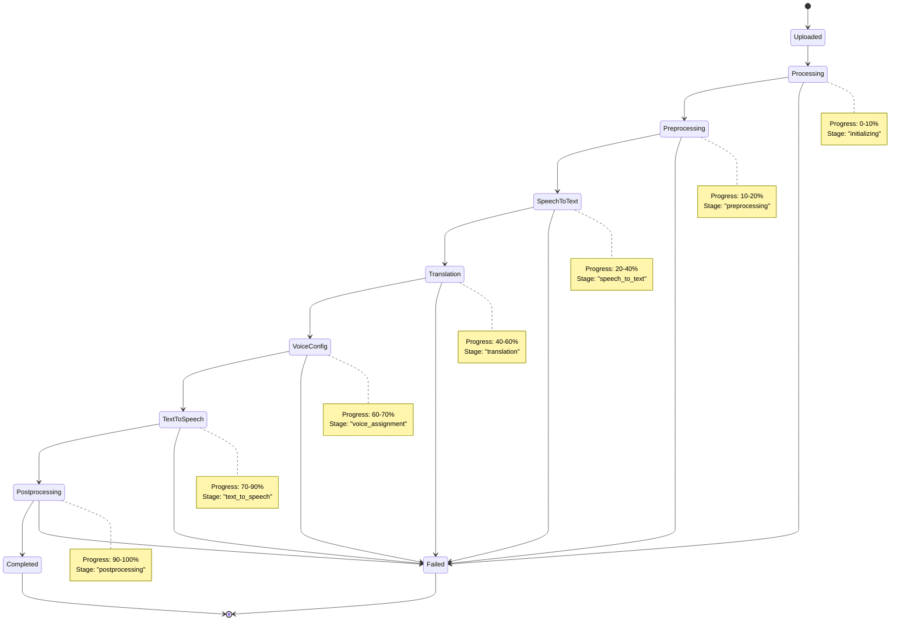

# Flow Diagrams

This document provides visual representations of all major flows and processes in the AI Video Translation Service. These diagrams help understand system interactions, data flow, and decision-making processes.

## 🎬 System Overview Flow

### High-Level System Architecture


## 📤 Upload and Job Creation Flow

### Complete Upload Process


### File Upload Decision Tree


## 🔄 Job Queue Processing Flow

### Queue Management System


### Concurrency Control Flow


## 🎭 Dubbing Pipeline Flow

### Seven-Stage Processing Pipeline


### Detailed Processing Flow with Error Handling


## 📡 Real-time Progress Updates Flow

### WebSocket Communication Flow


### Progress Update State Machine



## 🤖 AI Service Factory Flow

### Model Loading and Caching Flow


### Model Cache Management


## 🗄️ Database Operations Flow

### Job Lifecycle in Database


### Database Query Flow


## 🔄 Error Handling and Recovery Flow

### Error Propagation Flow


### Circuit Breaker Pattern Flow


## 🔐 Authentication and Security Flow

### Request Validation Flow


### File Upload Security Flow


## 📊 Performance Monitoring Flow

### Resource Usage Monitoring


### Performance Optimization Flow


## 🔄 Deployment and Scaling Flow

### Container Deployment Flow


### Auto-scaling Flow

```mermaid
graph TB
    subgraph "Metrics Collection"
        A[CPU Metrics] --> D[Metrics Aggregator]
        B[Memory Metrics] --> D
        C[Queue Length] --> D
    end
    
    subgraph "Scaling Decision"
        D --> E{Scale Up Needed?}
        D --> F{Scale Down Needed?}
        
        E -->|Yes| G[Increase Replicas]
        F -->|Yes| H[Decrease Replicas]
        E -->|No| I[Maintain Current]
        F -->|No| I
    end
    
    subgraph "Scaling Actions"
        G --> J[Create New Pods]
        H --> K[Terminate Pods]
        I --> L[Monitor Continuously]
    end
    
    J --> M[Load Balancer Update]
    K --> M
    M --> L
    L --> D
    
    style G fill:#e8f5e8
    style H fill:#fff3e0
    style I fill:#e3f2fd
```

## 🧪 Testing Flow

### Automated Testing Pipeline

```mermaid
flowchart TD
    A[Code Commit] --> B[Unit Tests]
    B --> C{Unit Tests Pass?}
    C -->|No| D[Fail Build]
    C -->|Yes| E[Integration Tests]
    E --> F{Integration Tests Pass?}
    F -->|No| D
    F -->|Yes| G[End-to-End Tests]
    G --> H{E2E Tests Pass?}
    H -->|No| D
    H -->|Yes| I[Performance Tests]
    I --> J{Performance OK?}
    J -->|No| K[Performance Alert]
    J -->|Yes| L[Deploy to Staging]
    L --> M[Manual Testing]
    M --> N{Manual Tests Pass?}
    N -->|No| O[Fix Issues]
    N -->|Yes| P[Deploy to Production]
    
    O --> A
    
    style D fill:#ffebee
    style K fill:#fff3e0
    style P fill:#e8f5e8
```

### Test Coverage Flow

```mermaid
graph LR
    subgraph "Unit Tests"
        A[Service Tests] --> D[Coverage Report]
        B[Model Tests] --> D
        C[Utility Tests] --> D
    end
    
    subgraph "Integration Tests"
        E[API Tests] --> F[Integration Report]
        G[Database Tests] --> F
        H[Queue Tests] --> F
    end
    
    subgraph "E2E Tests"
        I[Upload Flow] --> J[E2E Report]
        K[Processing Flow] --> J
        L[Download Flow] --> J
    end
    
    D --> M[Combined Coverage]
    F --> M
    J --> M
    M --> N{Coverage > 80%?}
    N -->|Yes| O[Quality Gate Pass]
    N -->|No| P[Quality Gate Fail]
    
    style O fill:#e8f5e8
    style P fill:#ffebee
```

## 🎯 Key Flow Characteristics

### Asynchronous Processing Benefits

1. **Non-blocking Operations**: File uploads don't block other requests
2. **Scalable Concurrency**: Multiple jobs processed simultaneously
3. **Resource Management**: Intelligent queuing prevents resource exhaustion
4. **Real-time Feedback**: Users get immediate job IDs and progress updates
5. **Fault Tolerance**: Failed jobs don't affect other processing

### Data Flow Patterns

1. **Upload → Queue → Process → Store → Download**: Linear progression with checkpoints
2. **Progress Broadcasting**: Real-time updates via WebSocket connections
3. **State Persistence**: Job state maintained in database throughout lifecycle
4. **Resource Cleanup**: Automatic cleanup of temporary files and resources
5. **Error Recovery**: Graceful error handling with user-friendly messages

### Scalability Considerations

1. **Horizontal Scaling**: Stateless design allows multiple service instances
2. **Queue Management**: Configurable concurrency limits prevent overload
3. **Model Caching**: Shared model cache reduces memory usage
4. **Database Optimization**: Efficient queries and indexing for job management
5. **File Storage**: Configurable storage backends for different deployment scenarios

### Security Measures

1. **Input Validation**: Comprehensive file and parameter validation
2. **Rate Limiting**: Prevents abuse and ensures fair resource usage
3. **Error Sanitization**: Secure error messages prevent information leakage
4. **Resource Limits**: Prevents denial of service attacks
5. **Content Scanning**: Security scanning for uploaded files

---

*This completes the comprehensive documentation for the AI Video Translation Service. All major flows, components, and architectural decisions have been documented with visual diagrams and detailed explanations.*
