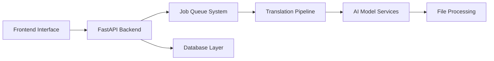

# Project Overview

## 🎯 Purpose and Main Functionality

The **AI Video Translation Service** is a comprehensive web application that automatically translates spoken content in videos from one language to another. The service combines multiple AI models to create a seamless dubbing experience that preserves the original video's timing, speaker characteristics, and visual content while replacing the audio with translated speech.

### Core Capabilities

- **Automatic Video Translation**: Upload an MP4 video and receive a fully dubbed version in your target language
- **Multi-Language Support**: Supports 10+ major languages including English, Spanish, French, German, Italian, Portuguese, Japanese, Korean, Chinese (Mandarin), and Hindi
- **Speaker Preservation**: Maintains speaker identity and gender characteristics in the translated audio
- **Real-time Processing**: Async job processing with live progress updates via WebSocket
- **Web Interface**: Modern, responsive frontend with drag-and-drop file upload
- **Job Management**: Persistent job tracking, status monitoring, and result download

## 🏗️ High-Level Architecture

The application follows a **microservices-inspired architecture** with clear separation of concerns:

### Architecture Layers

1. **Presentation Layer**: Web frontend with HTML/CSS/JavaScript
2. **API Layer**: FastAPI with RESTful endpoints and WebSocket support
3. **Business Logic Layer**: Translation service orchestration
4. **Data Layer**: SQLite database for job persistence
5. **Processing Layer**: AI model integration and file manipulation
6. **Infrastructure Layer**: Docker containerization and health monitoring

## 🔧 Technologies and Frameworks

### Backend Technologies

| Technology | Purpose | Version |
|------------|---------|---------|
| **FastAPI** | Web framework and API server | 0.104.0+ |
| **Python** | Primary programming language | 3.8+ |
| **Uvicorn** | ASGI server for FastAPI | 0.24.0+ |
| **SQLite** | Database for job persistence | Built-in |
| **aiosqlite** | Async SQLite driver | 0.19.0+ |
| **WebSockets** | Real-time progress updates | 11.0.0+ |

### AI and Machine Learning

| Model/Library | Purpose | Details |
|---------------|---------|---------|
| **Whisper** | Speech-to-Text (STT) | OpenAI's speech recognition model |
| **NLLB** | Translation | Meta's No Language Left Behind translation model |
| **MMS** | Text-to-Speech (TTS) | Meta's Massively Multilingual Speech model |
| **PyAnnote** | Speaker Diarization | Speaker identification and segmentation |
| **PyTorch** | ML Framework | CPU-optimized for model inference |
| **Transformers** | Model Loading | Hugging Face transformers library |

### Audio/Video Processing

| Tool | Purpose | Usage |
|------|---------|-------|
| **FFmpeg** | Audio/video manipulation | Splitting, combining, format conversion |
| **MoviePy** | Video processing | Python wrapper for video operations |
| **PyDub** | Audio processing | Audio segment manipulation |

### Frontend Technologies

| Technology | Purpose | Implementation |
|------------|---------|----------------|
| **HTML5** | Structure | Semantic markup with modern features |
| **CSS3** | Styling | Grid/Flexbox layouts, animations |
| **JavaScript** | Interactivity | Vanilla JS with modern ES6+ features |
| **WebSocket API** | Real-time updates | Native browser WebSocket support |
| **Font Awesome** | Icons | Icon library for UI elements |

### Infrastructure and DevOps

| Technology | Purpose | Configuration |
|------------|---------|---------------|
| **Docker** | Containerization | Multi-stage builds for optimization |
| **Docker Compose** | Orchestration | Service definition and networking |
| **Nginx** | Reverse Proxy | (Optional) Load balancing and SSL |
| **Health Checks** | Monitoring | Built-in health endpoints |

## 🎬 Translation Process Overview

The service implements a sophisticated **7-stage translation pipeline**:

### Stage 1: Preprocessing
- Video/audio separation using FFmpeg
- Speaker diarization with PyAnnote
- Audio segmentation by speaker and timing

### Stage 2: Speech Recognition
- Whisper-based speech-to-text conversion
- Language detection (if source language not specified)
- Gender classification for voice matching

### Stage 3: Translation
- NLLB model for text translation
- Context-aware translation preserving meaning
- Support for 200+ language pairs

### Stage 4: Voice Assignment
- Speaker-to-voice mapping based on gender
- Voice selection from available TTS voices
- Consistency maintenance across segments

### Stage 5: Text-to-Speech
- MMS model for natural speech synthesis
- Timing preservation for lip-sync compatibility
- Quality optimization for target language

### Stage 6: Audio Processing
- Dubbed audio track creation
- Volume normalization and quality enhancement
- Seamless audio segment combination

### Stage 7: Final Assembly
- Video and dubbed audio recombination
- Format optimization and compression
- Quality validation and output generation

## 🌟 Key Features and Benefits

### For End Users
- **Simple Upload**: Drag-and-drop interface for easy file upload
- **Progress Tracking**: Real-time updates on translation progress
- **Quality Output**: Professional-grade dubbed videos
- **Fast Processing**: Optimized pipeline for quick turnaround
- **Multiple Formats**: Support for various video formats and qualities

### For Developers
- **Modular Design**: Clean separation of concerns for easy maintenance
- **Async Processing**: Non-blocking job queue for scalability
- **Comprehensive APIs**: RESTful endpoints for all operations
- **Health Monitoring**: Built-in health checks and status reporting
- **Docker Ready**: Containerized for easy deployment

### For Operations
- **Scalable Architecture**: Designed for horizontal scaling
- **Resource Efficient**: CPU-optimized models for cost-effective deployment
- **Monitoring Ready**: Comprehensive logging and health endpoints
- **Configuration Flexible**: Environment-based configuration management

## 🎯 Use Cases

### Primary Use Cases
1. **Content Localization**: Translate marketing videos for global audiences
2. **Educational Content**: Make training materials accessible in multiple languages
3. **Entertainment**: Dub movies, shows, or YouTube content
4. **Corporate Communications**: Translate company announcements and presentations
5. **Accessibility**: Provide content in users' native languages

### Technical Use Cases
1. **API Integration**: Embed translation capabilities in existing applications
2. **Batch Processing**: Handle multiple videos through programmatic interfaces
3. **Workflow Integration**: Connect with content management systems
4. **Quality Assurance**: Preview and validate translations before publication

## 📊 Performance Characteristics

### Processing Speed
- **Small videos** (< 5 minutes): 2-5 minutes processing time
- **Medium videos** (5-15 minutes): 5-15 minutes processing time
- **Large videos** (15+ minutes): Proportional scaling with content length

### Resource Requirements
- **CPU**: Optimized for CPU-only inference (no GPU required)
- **Memory**: 4-8GB RAM recommended for optimal performance
- **Storage**: Temporary storage for processing, configurable cleanup
- **Network**: Minimal bandwidth requirements for model downloads

### Scalability
- **Concurrent Jobs**: Configurable job queue with worker limits
- **Model Caching**: Intelligent model loading and memory management
- **Horizontal Scaling**: Stateless design supports multiple instances
- **Load Balancing**: Compatible with standard load balancing solutions

---

*Next: [Component Breakdown](components.md) - Detailed analysis of individual system components*
